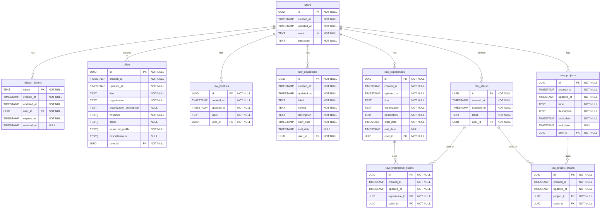

```mermaid
erDiagram
    users {
        UUID id PK "NOT NULL"
        TIMESTAMP created_at "NOT NULL"
        TIMESTAMP updated_at "NOT NULL"
        TEXT email UK "NOT NULL"
        TEXT password "NOT NULL"
    }
    
    refresh_tokens {
        TEXT token PK "NOT NULL"
        TIMESTAMP created_at "NOT NULL"
        TIMESTAMP updated_at "NOT NULL"
        UUID user_id FK "NOT NULL"
        TIMESTAMP expires_at "NOT NULL"
        TIMESTAMP revoked_at "NULL"
    }
    
    offers {
        UUID id PK "NOT NULL"
        TIMESTAMP created_at "NOT NULL"
        TIMESTAMP updated_at "NOT NULL"
        TEXT title "NOT NULL"
        TEXT organization "NOT NULL"
        TEXT organization_description "NULL"
        TEXT[] missions "NOT NULL"
        TEXT[] stack "NULL"
        TEXT[] expected_profile "NOT NULL"
        TEXT[] miscellaneous "NULL"
        UUID user_id FK "NOT NULL"
    }
    
    raw_hobbies {
        UUID id PK "NOT NULL"
        TIMESTAMP created_at "NOT NULL"
        TIMESTAMP updated_at "NOT NULL"
        TEXT label "NOT NULL"
        UUID user_id FK "NOT NULL"
    }
    
    raw_educations {
        UUID id PK "NOT NULL"
        TIMESTAMP created_at "NOT NULL"
        TIMESTAMP updated_at "NOT NULL"
        TEXT label "NOT NULL"
        TEXT school "NOT NULL"
        TEXT description "NOT NULL"
        TIMESTAMP start_date "NOT NULL"
        TIMESTAMP end_date "NULL"
        UUID user_id FK "NOT NULL"
    }
    
    raw_experiences {
        UUID id PK "NOT NULL"
        TIMESTAMP created_at "NOT NULL"
        TIMESTAMP updated_at "NOT NULL"
        TEXT title "NOT NULL"
        TEXT organization "NOT NULL"
        TEXT description "NOT NULL"
        TIMESTAMP start_date "NOT NULL"
        TIMESTAMP end_date "NULL"
        UUID user_id FK "NOT NULL"
    }
    
    raw_stacks {
        UUID id PK "NOT NULL"
        TIMESTAMP created_at "NOT NULL"
        TIMESTAMP updated_at "NOT NULL"
        TEXT label "NOT NULL"
        UUID user_id FK "NOT NULL"
    }
    
    raw_experience_stacks {
        UUID id PK "NOT NULL"
        TIMESTAMP created_at "NOT NULL"
        TIMESTAMP updated_at "NOT NULL"
        UUID experience_id FK "NOT NULL"
        UUID stack_id FK "NOT NULL"
    }
    
    raw_projects {
        UUID id PK "NOT NULL"
        TIMESTAMP created_at "NOT NULL"
        TIMESTAMP updated_at "NOT NULL"
        TEXT label "NOT NULL"
        TEXT description "NOT NULL"
        TIMESTAMP start_date "NOT NULL"
        TIMESTAMP end_date "NULL"
        UUID user_id FK "NOT NULL"
    }
    
    raw_project_stacks {
        UUID id PK "NOT NULL"
        TIMESTAMP created_at "NOT NULL"
        TIMESTAMP updated_at "NOT NULL"
        UUID project_id FK "NOT NULL"
        UUID stack_id FK "NOT NULL"
    }
    
    users ||--o{ refresh_tokens : "has"
    users ||--o{ offers : "creates"
    users ||--o{ raw_hobbies : "has"
    users ||--o{ raw_educations : "has"
    users ||--o{ raw_experiences : "has"
    users ||--o{ raw_stacks : "defines"
    users ||--o{ raw_projects : "has"
    raw_experiences ||--o{ raw_experience_stacks : "uses"
    raw_stacks ||--o{ raw_experience_stacks : "used_in"
    raw_projects ||--o{ raw_project_stacks : "uses"
    raw_stacks ||--o{ raw_project_stacks : "used_in"
```
