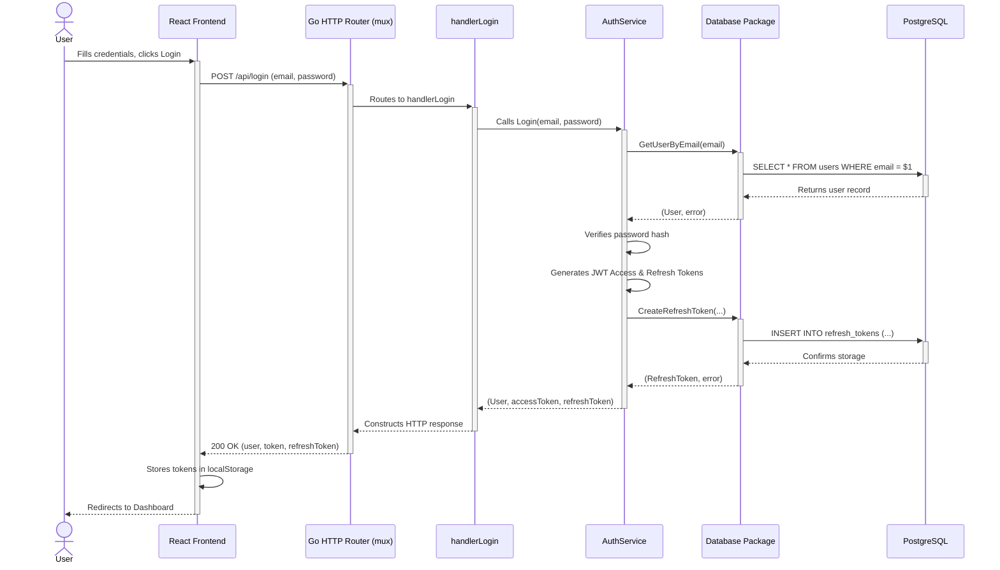

```mermaid
sequenceDiagram
    actor User
    participant Web as React Frontend
    participant API as Go HTTP Router (mux)
    participant Handlers as handlerLogin
    participant AuthService
    participant DBPackage as Database Package
    participant PostgreSQL

    User->>+Web: Fills credentials, clicks Login
    Web->>+API: POST /api/login (email, password)
    API->>+Handlers: Routes to handlerLogin
    Handlers->>+AuthService: Calls Login(email, password)
    AuthService->>+DBPackage: GetUserByEmail(email)
    DBPackage->>+PostgreSQL: SELECT * FROM users WHERE email = $1
    PostgreSQL-->>-DBPackage: Returns user record
    DBPackage-->>-AuthService: (User, error)
    AuthService->>AuthService: Verifies password hash
    AuthService->>AuthService: Generates JWT Access & Refresh Tokens
    AuthService->>+DBPackage: CreateRefreshToken(...)
    DBPackage->>+PostgreSQL: INSERT INTO refresh_tokens (...)
    PostgreSQL-->>-DBPackage: Confirms storage
    DBPackage-->>-AuthService: (RefreshToken, error)
    AuthService-->>-Handlers: (User, accessToken, refreshToken)
    Handlers-->>-API: Constructs HTTP response
    API-->>-Web: 200 OK (user, token, refreshToken)
    Web->>Web: Stores tokens in localStorage
    Web-->>-User: Redirects to Dashboard
```
