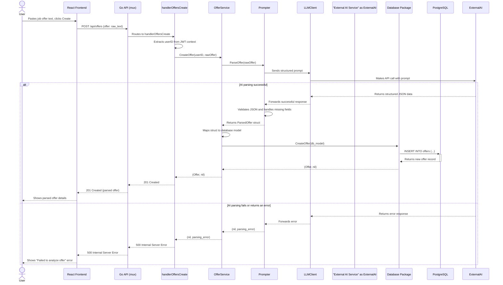

```mermaid
sequenceDiagram
    actor User
    participant Web as React Frontend
    participant API as Go API (mux)
    participant Handlers as handlerOffersCreate
    participant OfferService
    participant Prompter
    participant LLMClient
    participant "External AI Service" as ExternalAI
    participant DBPackage as Database Package
    participant PostgreSQL

    User->>Web: Pastes job offer text, clicks Create
    Web->>API: POST /api/offers (offer: raw_text)

    API->>Handlers: Routes to handlerOffersCreate
    Handlers->>Handlers: Extracts userID from JWT context
    Handlers->>OfferService: CreateOffer(userID, rawOffer)
    OfferService->>Prompter: ParseOffer(rawOffer)
    Prompter->>LLMClient: Sends structured prompt
    LLMClient->>ExternalAI: Makes API call with prompt

    alt AI parsing successful
        ExternalAI-->>LLMClient: Returns structured JSON data
        LLMClient-->>Prompter: Forwards successful response
        Prompter->>Prompter: Validates JSON and handles missing fields
        Prompter-->>OfferService: Returns ParsedOffer struct

        OfferService->>OfferService: Maps struct to database model
        OfferService->>+DBPackage: CreateOffer(db_model)
        DBPackage->>+PostgreSQL: INSERT INTO offers (...)
        PostgreSQL-->>-DBPackage: Returns new offer record
        DBPackage-->>OfferService: (Offer, nil)
        OfferService-->>Handlers: (Offer, nil)
        Handlers-->>API: 201 Created
        API-->>Web: 201 Created (parsed offer)
        Web-->>User: Shows parsed offer details

    else AI parsing fails or returns an error
        ExternalAI-->>LLMClient: Returns error response
        LLMClient-->>Prompter: Forwards error
        Prompter-->>OfferService: (nil, parsing_error)
        OfferService-->>Handlers: (nil, parsing_error)
        Handlers-->>API: 500 Internal Server Error
        API-->>Web: 500 Internal Server Error
        Web-->>User: Shows "Failed to analyze offer" error
    end
```
