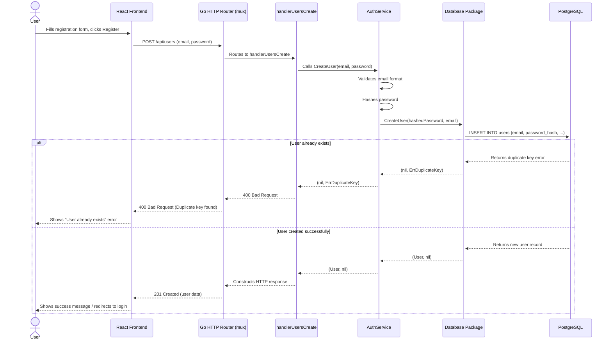

```mermaid
sequenceDiagram
  actor User as User
  participant Web as React Frontend
  participant API as Go HTTP Router (mux)
  participant Handlers as handlerUsersCreate
  participant AuthService as AuthService
  participant DBPackage as Database Package
  participant PostgreSQL as PostgreSQL

  User ->>+ Web: Fills registration form, clicks Register
  Web ->>+ API: POST /api/users (email, password)
  API ->>+ Handlers: Routes to handlerUsersCreate
  Handlers ->>+ AuthService: Calls CreateUser(email, password)
  AuthService ->> AuthService: Validates email format
  AuthService ->> AuthService: Hashes password
  AuthService ->>+ DBPackage: CreateUser(hashedPassword, email)
  DBPackage ->>+ PostgreSQL: INSERT INTO users (email, password_hash, ...)
  alt User already exists
    PostgreSQL -->> DBPackage: Returns duplicate key error
    DBPackage -->> AuthService: (nil, ErrDuplicateKey)
    AuthService -->> Handlers: (nil, ErrDuplicateKey)
    Handlers -->> API: 400 Bad Request
    API -->> Web: 400 Bad Request (Duplicate key found)
    Web -->> User: Shows "User already exists" error
  else User created successfully
    PostgreSQL -->> DBPackage: Returns new user record
    DBPackage -->> AuthService: (User, nil)
    AuthService -->> Handlers: (User, nil)
    Handlers -->> API: Constructs HTTP response
    API -->> Web: 201 Created (user data)
    Web -->> User: Shows success message / redirects to login
  end
```
